# 摘要

随着在线学习平台和智能问答技术的持续发展，传统静态题库在检索精度、答题反馈及时性和学习过程分析等方面逐渐暴露出局限。围绕知识问答场景中题目管理分散、用户作答反馈滞后以及语义检索能力不足等问题，设计并实现了一套基于 Spring Boot 的 AI 助力知识问答库系统。系统以 SlothAsk 项目为实现基础，采用前后端分离与微服务协同模式构建，后端以 Spring Boot、Spring Cloud、Spring Gateway 和 MyBatis-Plus 为核心，结合 MySQL、Redis、RabbitMQ 与 Qdrant 实现题库管理、在线答题、AI 解析、语义检索和学习统计等业务能力，前端基于 Vue 3 与 TypeScript 构建用户端和管理端交互界面。

在需求分析阶段，结合题库项目分类、题目详情、用户答题记录、评论互动和学习统计等真实功能，对游客、注册用户和管理员三类角色的使用场景进行了梳理；在系统设计阶段，完成了功能模块设计、微服务架构设计、部署结构设计以及以题目、题库分类、用户答题记录和 AI 分析记录为核心的数据模型设计；在系统实现阶段，重点阐述了题库浏览与筛选、答案草稿保存与提交、基于 RabbitMQ 的 AI 解析异步处理、基于 Qdrant 的向量化相似题目检索以及基于 Redis 与队列的学习历史批量入库机制。

测试结果表明，该系统能够完成用户登录后浏览题库、筛选题目、作答并提交答案、获取 AI 解析结果、查看学习统计与历史记录、参与评论互动等核心业务流程。系统在微服务拆分、异步消息解耦和语义检索扩展方面具有较好的工程可维护性。研究结果说明，将 Spring Boot 微服务架构与大模型能力、向量检索机制相结合，能够有效提升知识问答库系统在学习反馈效率和题目检索准确性方面的应用价值。

关键词：Spring Boot；知识问答库；AI解析；语义检索；微服务架构

# Abstract

With the continuous development of online learning platforms and intelligent question answering technology, traditional static question banks are no longer sufficient in terms of retrieval precision, instant answer feedback, and learning process analysis. To address the problems of scattered question management, delayed feedback on user answers, and weak semantic retrieval in knowledge-oriented question answering scenarios, this thesis designs and implements an AI-assisted knowledge question bank system based on Spring Boot. The system is built upon the SlothAsk project and adopts a front-end and back-end separated microservice architecture. The back-end stack is centered on Spring Boot, Spring Cloud, Spring Gateway, and MyBatis-Plus, while MySQL, Redis, RabbitMQ, and Qdrant are introduced to support question bank management, online answering, AI analysis, semantic retrieval, and learning statistics. The front-end is implemented with Vue 3 and TypeScript for both user-side and admin-side interfaces.

During the requirement analysis stage, the thesis examines real functions such as project categories, question details, answer records, comment interaction, and study statistics, and identifies three major user roles: visitors, registered users, and administrators. During the system design stage, the work completes the functional module design, microservice architecture design, deployment design, and data model design centered on questions, question categories, user answer records, and AI analysis records. During the implementation stage, the thesis focuses on question browsing and filtering, answer draft saving and submission, asynchronous AI analysis based on RabbitMQ, vector-based similar question retrieval built on Qdrant, and the history recording mechanism that combines Redis and queued batch persistence.

The testing results indicate that the system can support the full workflow in which users log in, browse question banks, filter questions, submit answers, obtain AI-generated analysis, review study statistics and history, and participate in comment interaction. The system shows good engineering maintainability in microservice decomposition, asynchronous decoupling, and semantic retrieval extensibility. The study demonstrates that combining Spring Boot microservices with large language model capability and vector retrieval can effectively improve the response efficiency and retrieval quality of a knowledge question answering system.

Key Words: Spring Boot; knowledge question bank; AI analysis; semantic retrieval; microservice architecture

# 第1章 绪论

## 1.1 课题背景与研究意义

在在线教育、技术学习和岗位准备等应用场景中，题库系统长期承担知识组织、训练反馈和学习评估的重要作用。传统题库系统通常以分类浏览、关键字检索和标准答案展示为主，能够满足基本的知识查阅需求，但在复杂知识检索、学习过程跟踪和开放式答案反馈方面仍存在明显不足。一方面，题库内容不断增长后，仅依靠分类树与关键字匹配难以准确定位语义接近的问题；另一方面，对于简答题、开放题和综合题，系统若只提供标准答案展示，难以支持用户对自己答案质量的即时判断。随着大模型技术和检索增强技术的发展，将 AI 解析能力和向量检索机制引入知识问答平台，已成为提升学习平台智能化水平的重要方向[1][2]。

Spring Boot 及其配套生态在企业级后端开发中已形成成熟的工程体系。基于 Spring Boot 构建知识问答平台，能够较好地解决服务拆分、统一网关、配置管理、权限控制和数据库访问等工程问题[4][5]。同时，Qdrant 等向量数据库的引入，使得系统可以围绕题目标题与题干内容建立高维向量索引，进而支持语义层面的相似题目查询[2][9]。Redis、RabbitMQ 和 SSE 等基础组件则能够在缓存优化、异步解耦与实时通知方面提供支撑[6][7]。因此，研究并实现一套基于 Spring Boot 的 AI 助力知识问答库系统，既具有明确的工程实践意义，也能够为智能题库平台建设提供较为完整的系统设计案例。

本课题以 SlothAsk 项目为实现对象，围绕题库浏览、在线答题、AI 解析、语义搜索和学习统计等业务功能开展系统化设计。与仅提供静态练习题展示的平台相比，该系统强化了题目语义检索、答案智能评估和学习行为统计功能，使知识问答平台在用户学习闭环构建方面更具实用性。对于软件工程专业毕业设计而言，该项目涵盖了需求分析、架构设计、数据库设计、前后端协同、异步消息处理与系统测试等多个关键环节，具备较高的综合训练价值。

## 1.2 国内外研究现状

国外在知识问答系统和智能学习平台方面起步较早，研究重点主要集中在信息检索增强、问答模型能力提升和学习行为分析等方向。Vaswani 等提出的 Transformer 结构为现代自然语言理解提供了核心建模框架[3]，随后检索增强生成技术进一步强化了模型对外部知识的调用能力。Lewis 等提出的 RAG 框架将检索模块与生成模块结合，使问答系统在知识密集型任务上的回答质量得到提升[1]。在高维向量检索领域，Johnson 等围绕大规模相似度搜索提出了高效索引与近似计算方法，为后续向量数据库的工程应用奠定了基础[2]。这些研究说明，智能问答系统的发展趋势已经从单一语法匹配和规则匹配逐渐转向语义建模、外部知识结合与多阶段推理。

从工程实现角度看，国外主流平台在问答系统构建中普遍采用微服务架构与云原生部署方式，以便在用户访问量提升和模型服务扩展时保持较好的系统弹性[5]。同时，Redis、消息队列和流式推送机制常被用于支撑用户状态维护、异步任务处理和结果通知[6][7]。在教育场景中，智能问答与知识训练系统逐步引入学习进度跟踪、错题管理、推荐题目和学习热力图等模块，以形成以学习者为中心的数据闭环。

国内关于智能题库与问答平台的研究近年也呈现快速增长趋势。大量实践项目将 Spring Boot、Vue 和 MySQL 作为基础技术组合，通过 RESTful 接口完成题库维护、答题训练和后台管理，在工程成本和开发效率之间取得了较好平衡[4][11]。近年来，围绕在线教育智能题库、微服务学习平台和语义问答关键技术的研究也逐步增多[12][13][14]。随着生成式 AI 的广泛应用，越来越多的系统开始尝试在题目解析、答题评语、知识点总结和用户问答等环节引入大模型能力，以缩短反馈时间并增强个性化学习体验[10][15]。不过，从现有平台实现情况看，许多系统仍然停留在同步调用大模型、关键字搜索或简化统计的层面，对异步 AI 处理、向量化检索以及多服务协同机制的系统性整合还不充分。

综合国内外研究现状可以看出，智能知识问答平台正在向“结构化题库管理 + 语义检索 + AI 反馈 + 学习行为分析”的方向演进。然而，如何在工程上将题库管理、答题记录、AI 解析、语义检索、缓存优化和消息通知统一到一个具备良好可维护性的系统中，仍是值得深入研究的问题。基于这一认识，本课题选择在 Spring Boot 微服务架构下实现 AI 助力知识问答库系统，以真实工程项目为基础探索其分析、设计与实现过程。

## 1.3 论文主要研究内容

本文围绕基于 Spring Boot 的 AI 助力知识问答库系统展开研究，主要工作包括以下几个方面。

第一，对系统的应用场景和角色需求进行分析。结合系统前端页面、后端接口和数据库模型，明确游客、注册用户和管理员在题库浏览、在线答题、AI 解析、评论互动和后台管理中的职责边界，形成面向实际功能的需求模型。

第二，完成系统总体设计与数据库设计。依据微服务目录结构、网关过滤器、配置中心和核心业务服务，对系统的模块划分、服务协作关系、部署结构和数据库概念模型进行设计，重点分析题目、题库分类、答题记录和 AI 分析结果之间的关联结构[4][5]。

第三，分析并实现系统的核心业务流程。结合源码事实，重点论述题库浏览与筛选、答案草稿保存与提交、RabbitMQ 异步 AI 解析、Qdrant 语义搜索、Redis 缓存与学习历史队列化入库等关键实现机制，并说明前后端如何协同完成用户学习闭环。

第四，对系统进行功能测试和非功能性验证。围绕用户认证、题库检索、在线答题、AI 解析、评论互动和学习统计等功能构造测试用例，结合系统接口约束和业务逻辑分析测试结果，从而验证系统设计的合理性与实现的可用性。

## 1.4 论文章节安排

本文共分为五个主体章节，内容安排如下。

第一章为绪论，介绍课题背景、研究意义、国内外研究现状、论文研究内容和章节安排。

第二章为系统需求分析，围绕系统角色、业务流程、功能需求和非功能需求展开，给出用例图、用例描述与需求汇总。

第三章为系统设计，重点介绍系统功能模块设计、开发结构设计、总体架构设计、部署设计以及数据库概念结构和逻辑结构设计。

第四章为系统实现，围绕题库浏览与筛选、在线答题与答案记录、AI 解析、语义搜索、学习统计与历史记录、评论互动与后台管理等核心功能展开实现分析。

第五章为系统测试，给出测试环境、功能测试用例、非功能测试和测试结果分析。

# 第2章 系统需求分析

## 2.1 可行性分析

系统可行性分析需要从技术、经济和运行三个层面展开。首先，从技术可行性看，系统后端基于 Spring Boot 和 Spring Cloud 构建，具备成熟的服务注册、网关路由和配置管理支持；MyBatis-Plus、MySQL 与 Redis 共同承担结构化数据存储和高频访问缓存；RabbitMQ 能够支撑 AI 分析任务的异步解耦；Qdrant 可用于题目语义向量检索，因此系统的核心技术路线具备良好的实现基础[4][5][6][7][9]。仓库中的 `Service-Question`、`Service-Ai`、`Service-Gateway` 和 `Service-Notification` 等目录已经形成较清晰的功能边界，也说明该项目具备落地实现条件。

其次，从经济可行性看，系统主要采用开源技术栈完成开发。Spring Boot、Vue 3、MySQL、Redis、RabbitMQ 和 Qdrant 均可在普通开发环境中部署运行，前期投入主要集中在服务器资源和模型调用费用。对于以知识学习和岗位准备为主的在线题库平台而言，采用开源框架与按需调用模型的方式，可以在保证功能完整性的同时降低项目建设成本。

再次，从运行可行性看，系统采用用户端和管理端分离设计，用户使用浏览器即可完成题库浏览、答题和统计查看，管理员可通过后台维护题目、分类与标签信息。网关在请求转发时会自动补充用户标识头部，降低了服务间用户身份传递的复杂度。消息服务通过 SSE 与 Redis 在线状态管理支撑实时消息推送，说明系统在实际运行流程上是连贯的。

综合来看，本系统在技术上具备成熟实现基础，在成本上具有较高可控性，在使用上也符合知识问答场景中的常见操作逻辑，因此具备较好的可行性。

## 2.2 非功能性需求分析

在知识问答平台中，非功能性需求直接影响用户学习体验和系统长期维护能力。本系统的非功能需求主要包括性能、安全性、可维护性和可扩展性四个方面。

在性能需求方面，系统需要支持用户快速完成题目列表浏览、条件筛选和题目详情查询。由于题库浏览、热门题目和分类读取属于高频读操作，因此需要通过 Redis 缓存和数据库索引降低查询延迟。对于 AI 解析等耗时任务，系统不要求在用户提交答案后同步返回完整解析结果，而是通过消息队列进行异步处理，从而避免阻塞主业务流程。

在安全性需求方面，系统至少需要具备统一身份鉴别和接口隔离能力。仓库中的网关过滤器会依据 Sa-Token 登录态向后端服务写入 `X-User-Id` 和 `X-Upc-Id` 请求头，说明系统在服务入口层实现了基础身份透传。与此同时，答案提交、评论发布、收藏题目和学习统计等接口均要求登录用户身份，后台维护接口则要求管理员身份，这体现了角色权限隔离需求。

在可维护性需求方面，系统将用户、题库、AI、通知和管理功能拆分到不同服务中，降低了单体系统耦合度。数据库表设计中以题目、分类、答题记录和 AI 分析表为中心，配合相对明确的 Mapper、Service 和 Controller 层次结构，便于后续功能扩展和缺陷定位。

在可扩展性需求方面，系统需要支持题库项目增加、题目数量增长、向量数据扩容和模型更换。项目分类表、题库分类表和标签表的分层设计为题库横向扩展提供了基础。AI 服务中嵌入模型和聊天模型采用枚举形式管理，也为后续接入新模型保留了扩展空间。向量检索采用独立的 Qdrant 集合，可在题目规模上升后继续扩容存储。

## 2.3 功能性需求分析

### 2.3.1 用例图

系统功能用例图如图2-1所示。该用例图围绕游客、注册用户和管理员三类角色展开，其中游客主要执行题库浏览和题目查看操作；注册用户在游客功能基础上进一步具备登录、保存答案、提交答案、触发 AI 解析、查看学习统计、评论和收藏等能力；管理员负责项目分类、题库分类、标签和题目内容的维护。

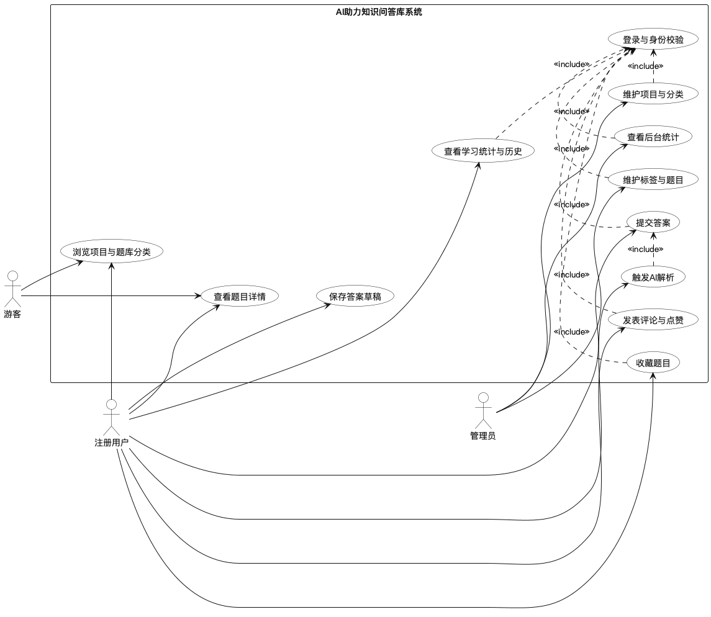

图2-1 系统用例图

### 2.3.2 用例描述

题库浏览用例对应系统的项目列表、题库分类、题目数量统计和分类详情等基础查询功能。该用例主要面向游客和注册用户，目标是在不进入复杂学习流程之前帮助用户快速定位需要的题库资源。题库浏览用例描述见表2-1。

表2-1 题库浏览用例描述

| 字段 | 内容 |
| --- | --- |
| 用例名 | 题库浏览 |
| 用例编号 | UC-01 |
| 用例类型 | 主业务用例 |
| 主要业务参与者 | 游客、注册用户 |
| 其他参与者 | 系统 |
| 描述 | 用户进入平台后查看项目分类、题库分类、题目数量和分类详情，并按分类进入题目列表。 |
| 前置条件 | 平台服务正常运行，题库项目和分类信息已录入。 |
| 后置条件 | 用户获得目标题库分类与题目入口信息。 |
| 触发条件 | 用户点击题库入口或学习首页分类。 |
| 基本流程 | 1. [用户] 打开题库首页。 2. [系统] 返回项目列表。 3. [用户] 选择项目。 4. [系统] 返回该项目下的题库分类和题目数量。 5. [用户] 进入目标分类。 6. [系统] 返回分类详情和题目列表。 |
| 替代流程 | 1. 若项目下暂无分类，则系统返回空列表。 2. 若分类不存在，则系统返回错误提示。 |
| 结束 | 用户进入题目浏览阶段或返回首页。 |
| 实现约束和说明 | 依赖 `GetQuestionBankController` 提供的项目、分类、题目数量和题目列表查询接口。 |
| 待解决问题 | 后续可增加更细粒度的推荐排序和个性化题库入口。 |

在线答题与提交用例对应用户在题目详情页中输入答案、保存草稿、提交答案以及重新作答的完整流程。该用例是系统学习闭环的核心入口，与用户答题记录表和学习统计逻辑直接相关。在线答题与提交用例描述见表2-2。

表2-2 在线答题与提交用例描述

| 字段 | 内容 |
| --- | --- |
| 用例名 | 在线答题与提交 |
| 用例编号 | UC-02 |
| 用例类型 | 主业务用例 |
| 主要业务参与者 | 注册用户 |
| 其他参与者 | 系统 |
| 描述 | 登录用户在题目详情页输入答案，可先保存草稿，再正式提交答案，提交后进入已作答状态。 |
| 前置条件 | 用户已登录，题目可访问。 |
| 后置条件 | 系统保存用户答案记录，并记录提交状态和提交时间。 |
| 触发条件 | 用户在题目详情页点击保存草稿或提交答案按钮。 |
| 基本流程 | 1. [用户] 打开题目详情。 2. [系统] 返回题目内容与历史答题状态。 3. [用户] 输入答案。 4. [用户] 点击保存草稿。 5. [系统] 调用保存接口写入答题记录。 6. [用户] 点击提交答案。 7. [系统] 校验答案记录归属并更新提交状态。 8. [系统] 返回提交成功信息。 |
| 替代流程 | 1. 若用户未登录，则提示登录。 2. 若答案为空，则禁止提交。 3. 若答案已提交，则禁止重复提交。 |
| 结束 | 用户进入已提交答案状态，可继续触发 AI 解析。 |
| 实现约束和说明 | 依赖 `PostAnswerQuestionController` 的 `saveAnswer` 和 `submitAnswer` 接口。 |
| 待解决问题 | 后续可增加富文本答案、自动保存和多版本草稿。 |

AI解析用例对应用户提交答案后触发智能评估的业务流程。该用例利用 RabbitMQ 实现异步解耦，既要保证同一答案不会被重复分析，也要保证用户可以在分析完成后收到可视化评语结果。AI解析用例描述见表2-3。

表2-3 AI解析用例描述

| 字段 | 内容 |
| --- | --- |
| 用例名 | AI解析 |
| 用例编号 | UC-03 |
| 用例类型 | 扩展业务用例 |
| 主要业务参与者 | 注册用户 |
| 其他参与者 | AI服务、消息队列、通知服务 |
| 描述 | 用户提交答案后，系统对答案进行准确率评估和解析文本生成，并将结果返回前端展示。 |
| 前置条件 | 用户已登录，答案已提交，AI服务可用。 |
| 后置条件 | 系统保存 AI 分析结果，并可供前端查询和展示。 |
| 触发条件 | 用户点击 AI 解析按钮或前端自动发起解析请求。 |
| 基本流程 | 1. [用户] 触发 AI 解析。 2. [系统] 校验答案归属和提交状态。 3. [系统] 检查是否已有分析记录或正在分析。 4. [系统] 设置 Redis 解析锁。 5. [系统] 发送 RabbitMQ 消息。 6. [AI服务] 消费消息并读取题目与用户答案。 7. [AI服务] 调用模型生成准确率和解析内容。 8. [系统] 保存 AI 分析结果并通知用户。 |
| 替代流程 | 1. 若答案不存在，则返回错误。 2. 若答案未提交，则拒绝分析。 3. 若正在分析，则返回处理中状态。 |
| 结束 | 用户查看 AI 分析结果或继续学习。 |
| 实现约束和说明 | 依赖 `SendAiAnalysisServiceImpl`、`AiAnalysisConsumer` 与通知服务。 |
| 待解决问题 | 后续可增加失败重试、死信队列与解析质量评估机制。 |

## 2.4 领域业务模型分析

系统的领域业务模型围绕“题库资源组织 - 用户学习行为 - AI 分析反馈”三条主线展开。首先，在题库资源组织层面，平台通过项目分类、题库分类和题目三级结构管理知识内容。项目分类对应较大的知识领域，如 Java 面试题、软考题或其他主题方向；题库分类作为项目下的细分知识单元，用于组织相同主题下的题目集合；题目则作为最小知识训练对象，包含题干、参考答案、难度、类型和标签等属性。

其次，在用户学习行为层面，系统通过题目访问历史、答案记录、错题本、收藏与提交统计等对象记录用户学习轨迹。用户浏览题目后，系统异步记录浏览历史；用户提交答案后，系统将答题状态、答案文本和提交时间写入答题记录表；提交次数统计与热力图数据进一步支撑学习活跃度可视化。该设计使系统不再只是题目展示平台，而是具备过程记录能力的学习支持系统。

再次，在 AI 分析反馈层面，系统将提交后的用户答案与标准答案结合，交由 AI 服务进行准确率分析和评语生成。AI 分析结果与答题记录是一对一关联关系，其输出既可视为对当前答案的即时反馈，也可作为用户复盘学习的重要依据。语义向量检索则为题目查询提供了相似问题发现能力，有助于用户围绕当前题目继续展开相关知识点学习。

用户学习答题业务流程如图2-2所示。该流程从题库选择开始，经历题目浏览、答案编辑、答案提交、AI 解析、结果展示和学习统计更新等步骤，形成相对完整的学习闭环。

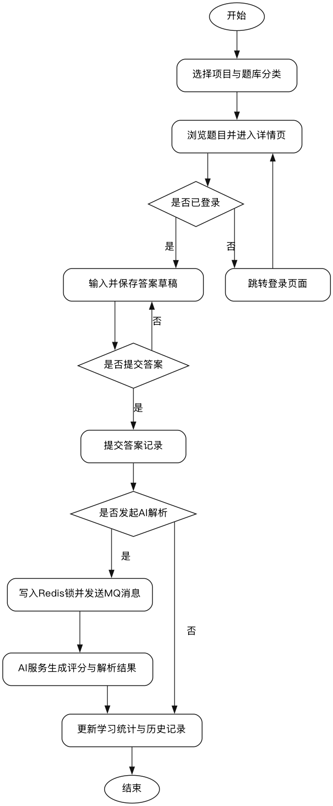

图2-2 用户学习答题业务流程图

系统功能需求汇总见表2-4。由表2-4可知，系统功能可归纳为题库浏览、题目学习、答案记录、AI 解析、语义检索、学习统计、互动交流和后台管理等八个模块。

表2-4 系统功能需求汇总表

| 需求编号 | 需求名称 | 提出角色 | 需求描述 | 优先级 | 对应模块 |
| --- | --- | --- | --- | --- | --- |
| FR-01 | 题库项目与分类浏览 | 游客、注册用户 | 查看项目、分类、题目数量与分类详情 | 高 | 题库浏览 |
| FR-02 | 题目查看与同类导航 | 游客、注册用户 | 查看题目详情、同分类题目和热门题目 | 高 | 题目学习 |
| FR-03 | 答案草稿保存与提交 | 注册用户 | 保存草稿、提交答案、重新答题 | 高 | 答案记录 |
| FR-04 | AI解析反馈 | 注册用户 | 提交后触发 AI 评分与解析 | 高 | AI解析 |
| FR-05 | 相似题目搜索 | 注册用户 | 基于语义检索返回相似题目 | 中 | 语义检索 |
| FR-06 | 学习统计与历史记录 | 注册用户 | 查看提交热力图、历史记录与热门题目 | 中 | 学习统计 |
| FR-07 | 评论与收藏 | 注册用户 | 评论题目、点赞、收藏和删除记录 | 中 | 互动交流 |
| FR-08 | 项目与题目维护 | 管理员 | 维护项目、分类、标签和题库内容 | 高 | 后台管理 |

## 2.5 本章小结

本章结合系统源码和数据库设计，对 AI 助力知识问答库系统的角色需求、业务流程、功能需求和非功能需求进行了分析。系统核心目标并非单纯提供静态题库，而是在题目组织、在线答题、语义检索和 AI 反馈之间形成可持续的学习闭环。需求分析结果为后续系统设计与实现提供了明确的业务边界和结构依据。

# 第3章 系统设计

## 3.1 系统功能模块设计

系统功能模块设计需要在满足知识问答场景需求的前提下，兼顾模块边界清晰、职责单一和后续扩展方便等要求。结合需求分析结果与仓库中的服务拆分情况，系统可划分为题库浏览模块、在线答题模块、AI 解析模块、语义搜索模块、学习统计模块、评论互动模块、通知模块和后台管理模块八个核心功能模块。

其中，题库浏览模块负责项目分类、题库分类、题目数量和题目详情查询，是所有学习流程的入口；在线答题模块负责答案草稿保存、答案提交和重新作答控制；AI 解析模块负责异步消费答题记录、调用大模型服务并生成准确率与评语；语义搜索模块负责题目文本向量化和相似题目召回；学习统计模块负责记录浏览历史、提交热力图和热门题目排行；评论互动模块负责评论树管理、点赞和删除逻辑；通知模块负责通过 SSE 输出在线消息与处理结果；后台管理模块负责项目、题库分类、标签和题目内容的维护。

系统功能模块图如图3-1所示。该图从用户业务视角描述系统的主要功能边界，体现了知识问答平台从题库内容管理到学习反馈闭环的组织方式。

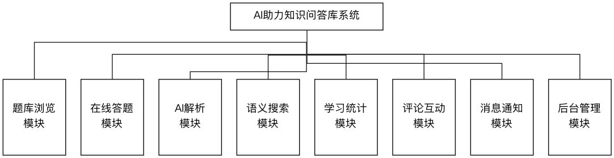

图3-1 系统功能模块图

## 3.2 系统开发结构设计

从工程目录结构看，系统采用前后端分离与多服务协同的开发组织形式。前端部分包括 `frontend-user-web` 和 `frontend-admin-web` 两个工程，分别面向普通用户和管理员。后端部分则按照业务和基础设施能力拆分为 `Service-Infrastructure`、`Service-Gateway`、`Service-Question`、`Service-Ai`、`Service-Notification`、`Service-User`、`Service-Admin` 等服务。这样的结构有助于在保证业务清晰度的同时，降低不同模块之间的直接耦合程度。

系统开发结构图如图3-2所示。由图3-2可知，前端工程通过网关访问业务服务，网关负责统一路由与身份透传；题库与学习核心逻辑集中在 `Service-Question` 中实现；AI 能力由 `Service-Ai` 提供；实时消息与邮件等通知能力由 `Service-Notification` 承担；用户与管理员分别由独立服务维护。该设计较好地体现了知识问答场景下业务服务与公共能力服务的分层思路。

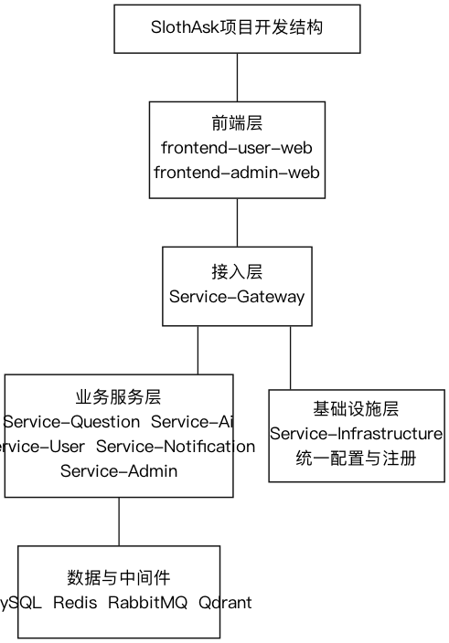

图3-2 系统开发结构图

## 3.3 系统架构设计

系统总体架构如图3-3所示。该架构由表示层、网关层、业务服务层和数据支撑层构成。表示层包括用户端和管理端浏览器页面，承担题目浏览、答案输入、统计查看和后台维护等交互任务。网关层由 Spring Gateway 实现，负责统一入口、路由分发及登录态解析，并向下游服务补充用户身份头信息。业务服务层包括题库服务、AI 服务、通知服务、用户服务和管理服务，其中题库服务是知识问答的核心业务承载者。数据支撑层则包含 MySQL、Redis、RabbitMQ、Qdrant 和可能存在的对象存储等组件。

网关层在系统中的作用较为关键。`UserHeaderGlobalFilter` 会在检测到用户或管理员已登录时，向转发请求中补充 `X-User-Id`、`X-Upc-Id` 或 `X-Admin-Id` 等信息，从而实现服务间的用户上下文透传。这种设计避免了下游服务重复解析登录态，提高了服务职责划分的清晰度。

对于 AI 解析场景，系统采用同步请求与异步处理结合的方式。用户在题目详情页提交答案后，由题库服务先完成答题记录持久化，再由 AI 解析接口发起请求。题库服务会校验答案是否属于当前用户、是否已提交、是否已存在 AI 结果或是否正在处理中；通过校验后，系统在 Redis 中写入解析锁并向 RabbitMQ 发送消息。AI 服务消费该消息后，读取题目内容、标准答案和用户答案，调用模型生成评分与评语，并将结果保存到 `user_answer_ai_analysis` 表中，同时通过通知服务提醒用户查看结果。此种架构既避免了模型调用阻塞前端，也提高了系统在高并发场景中的稳定性。

系统总体架构图如图3-3所示。

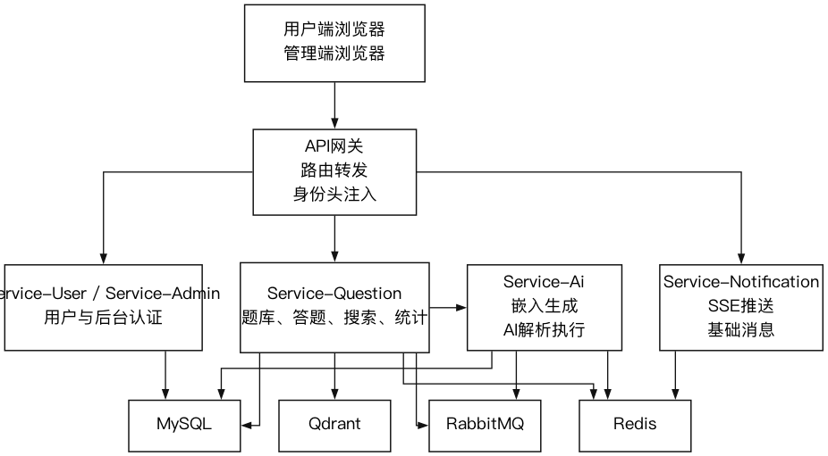

图3-3 系统总体架构图

## 3.4 系统部署设计

系统部署设计需要保证服务之间的访问路径清晰、依赖组件职责明确。结合 README 中的启动方式与配置中心目录结构，系统部署时至少包括浏览器客户端、API 网关、配置注册中心、业务微服务、MySQL 数据库、Redis 缓存、RabbitMQ 消息队列和 Qdrant 向量数据库等节点。浏览器端访问网关统一入口，网关根据路由规则转发至题库服务、AI 服务、用户服务和通知服务；各服务启动时从配置中心获取统一配置；MySQL 保存核心业务数据，Redis 保存缓存、在线状态和处理锁，RabbitMQ 用于异步 AI 任务分发，Qdrant 用于题目向量存储与相似检索。

系统部署图如图3-4所示。该部署结构能够较好地支撑知识问答平台中“读请求多、AI 任务耗时、状态更新频繁”的业务特点。

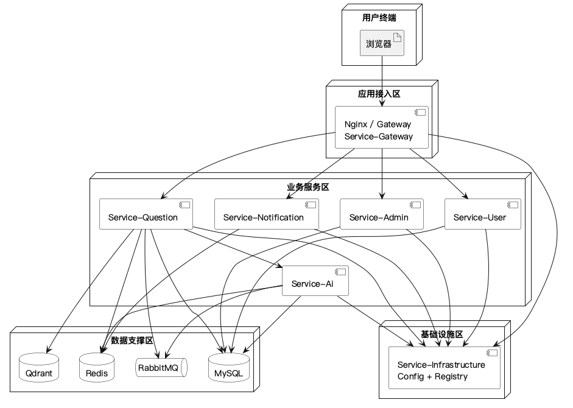

图3-4 系统部署图

## 3.5 数据库设计

### 3.5.1 数据库概念结构设计

数据库在本系统中承担题库内容组织、用户学习过程记录和 AI 结果留存等核心职责。根据 `design/database.sql` 中定义的数据表可以看出，系统数据模型并非围绕单一题目表构建，而是以项目分类、题库分类、题目、用户、答题记录、AI 分析记录、评论和历史记录等多个实体共同组成。数据库总 ER 图如图3-5所示，该图反映了系统中题库资源、用户行为和反馈数据之间的总体联系。

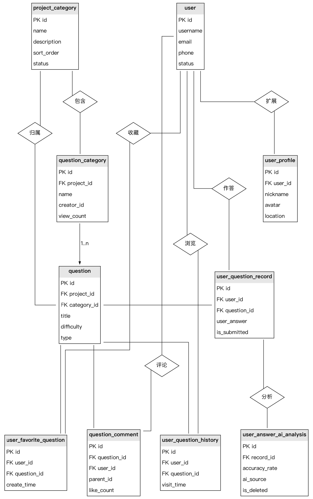

图3-5 数据库总ER图

用户实体结构如图3-6所示。该实体主要用于保存平台注册用户的基础身份信息，并通过用户扩展信息、学习行为和互动记录与其他业务实体形成关联。用户实体为登录认证、学习记录归属、评论发布和收藏行为提供统一主体标识。

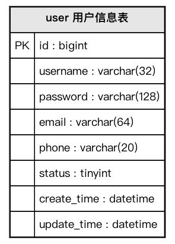

图3-6 用户实体结构图

题目实体结构如图3-7所示。该实体用于保存题目标题、题干内容、标准答案、难度级别、题目类型和标签分类等字段，是系统开展题目浏览、题目检索、在线答题和 AI 分析的基础数据对象。其 `project_id` 和 `category_id` 字段分别将题目关联到项目分类和题库分类，实现知识内容的分层组织。

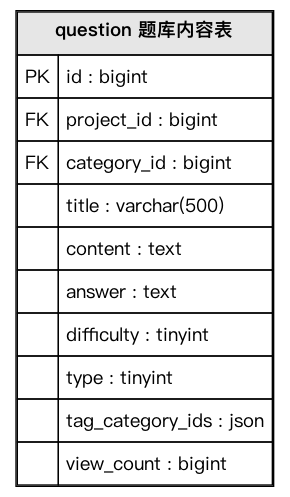

图3-7 题目实体结构图

题库分类实体结构如图3-8所示。该实体用于保存题库分类名称、描述、图标、排序和访问量等信息，并通过 `project_id` 字段归属到上层项目分类。它既承担题库入口组织作用，也为推荐分类、分页查询和分类详情展示提供数据支撑。

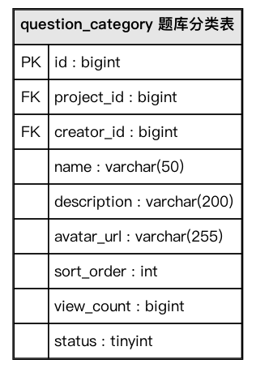

图3-8 题库分类实体结构图

用户答题记录实体结构如图3-9所示。该实体用于保存用户与题目之间的作答关系，核心字段包括用户编号、题目编号、用户答案、是否提交、创建时间和更新时间等内容。该实体既是 AI 解析功能的直接输入对象，也是学习统计与历史分析的重要数据来源。

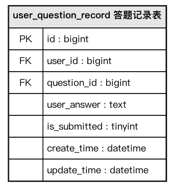

图3-9 用户答题记录实体结构图

AI 分析实体结构如图3-10所示。该实体用于保存某条答题记录对应的 AI 评估结果，字段主要包括准确率、AI 解析文本、来源模型、创建时间和更新时间等内容。该实体通过 `record_id` 与答题记录形成一对一关系，从而实现作答记录与智能反馈结果之间的可追踪关联。

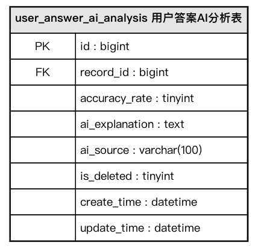

图3-10 AI分析实体结构图

### 3.5.2 数据库逻辑结构设计

数据库逻辑结构设计在概念模型基础上进一步落实到具体字段、数据类型、主外键和业务含义。关系型数据库在此阶段承担强一致业务数据管理职责，其设计原则与 MySQL 在事务、索引和约束方面的能力保持一致[8]。为了突出系统的主体业务，本文选取 `question`、`question_category`、`user_question_record` 和 `user_answer_ai_analysis` 四张核心表进行说明。

题库内容表设计见表3-1。该表是系统最核心的业务表之一，用于保存题目标题、题干、标准答案、难度、类型、标签和浏览量信息。其字段设计既支撑题目展示，也支撑 AI 分析和向量检索。

表3-1 question表设计

| 字段名 | 类型 | 主键/外键 | 可空 | 业务含义 |
| --- | --- | --- | --- | --- |
| id | bigint | 主键 | 否 | 题目唯一标识 |
| project_id | bigint | 外键 | 否 | 所属项目分类 |
| category_id | bigint | 外键 | 否 | 所属题库分类 |
| title | varchar(500) | 否 | 否 | 题目标题 |
| content | text | 否 | 否 | 题目内容 |
| answer | text | 否 | 否 | 标准答案 |
| difficulty | tinyint | 否 | 否 | 难度等级 |
| type | tinyint | 否 | 否 | 题目类型 |
| tag_category_ids | json | 否 | 否 | 标签集合 |
| status | tinyint | 否 | 否 | 状态标记 |
| view_count | bigint | 否 | 否 | 浏览次数 |

题库分类表设计见表3-2。该表保存题库分类基础信息，与项目分类形成从属关系，同时也通过排序和访问量支撑首页推荐与列表呈现。

表3-2 question_category表设计

| 字段名 | 类型 | 主键/外键 | 可空 | 业务含义 |
| --- | --- | --- | --- | --- |
| id | bigint | 主键 | 否 | 分类唯一标识 |
| project_id | bigint | 外键 | 否 | 所属项目 |
| creator_id | bigint | 外键 | 否 | 创建者编号 |
| name | varchar(100) | 否 | 否 | 分类名称 |
| description | varchar(255) | 是 | 是 | 分类说明 |
| icon | varchar(255) | 是 | 是 | 分类图标 |
| sort_order | int | 否 | 否 | 排序序号 |
| view_count | bigint | 否 | 否 | 分类浏览量 |
| status | tinyint | 否 | 否 | 状态标记 |

用户答题记录表设计见表3-3。该表承担保存答案草稿、提交状态和提交时间等职责，是连接用户学习行为与 AI 智能评估的核心桥梁。

表3-3 user_question_record表设计

| 字段名 | 类型 | 主键/外键 | 可空 | 业务含义 |
| --- | --- | --- | --- | --- |
| id | bigint | 主键 | 否 | 答题记录编号 |
| user_id | bigint | 外键 | 否 | 用户编号 |
| question_id | bigint | 外键 | 否 | 题目编号 |
| user_answer | text | 否 | 否 | 用户答案文本 |
| is_submitted | tinyint | 否 | 否 | 是否已提交 |
| submit_time | datetime | 是 | 是 | 提交时间 |
| create_time | datetime | 否 | 否 | 创建时间 |
| update_time | datetime | 否 | 否 | 更新时间 |

AI 分析结果表设计见表3-4。该表记录 AI 对用户答案的准确率评估和文字解析结果，为题目复盘和学习反馈提供直接依据。

表3-4 user_answer_ai_analysis表设计

| 字段名 | 类型 | 主键/外键 | 可空 | 业务含义 |
| --- | --- | --- | --- | --- |
| id | bigint | 主键 | 否 | AI 结果编号 |
| record_id | bigint | 外键 | 否 | 对应答题记录编号 |
| accuracy_rate | tinyint unsigned | 否 | 否 | AI 判定准确率 |
| ai_explanation | text | 否 | 否 | AI 解析内容 |
| ai_source | varchar(100) | 否 | 否 | 来源模型名称 |
| create_time | datetime | 否 | 否 | 创建时间 |
| update_time | datetime | 否 | 否 | 更新时间 |

除上述核心表外，系统还设计了评论表、评论点赞表、错题本表、学习历史表和用户每日提交次数表等辅助数据结构。这些表共同支撑评论互动、错题管理、热力图统计和学习轨迹分析等扩展功能。

## 3.6 本章小结

本章围绕系统功能模块、开发结构、总体架构、部署结构和数据库模型完成了系统设计。通过将题库浏览、在线答题、AI 解析、语义检索、学习统计和互动功能拆分为清晰模块，并以多服务协同方式组织实现，系统在工程结构上具备了较好的可维护性。数据库设计以题目、分类、答题记录和 AI 分析结果为核心，较好地支撑了系统的主要业务流程。

# 第4章 系统实现

## 4.1 题库浏览与筛选功能实现

题库浏览与筛选功能是用户进入系统后的首个核心交互环节，其实现目标是帮助用户以较低操作成本完成项目定位、题库分类选择和题目列表浏览。系统在后端通过 `GetQuestionBankController` 提供项目列表、分类列表、分类详情、题目数量和题目列表等接口，在前端通过 `QuestionBankPage`、`StudyPage` 等页面构建分类展示与题目筛选界面。

在题库浏览实现过程中，系统首先根据项目分类维度组织题库入口。用户访问题库页时，前端会调用项目列表接口获取当前可用项目，再依据项目编号请求对应题库分类。对于题库分类的分页获取，系统提供了带页码和页面大小参数的查询接口，使得分类数量增加时仍能够保持较好的加载效率。对于分类详情页，系统还会查询题目数量和分类说明，从而为用户提供进一步选择依据。

在筛选功能实现上，`GetUserStudyController` 中的 `questionList` 接口支持按分类、标签、题目类型、难度和搜索文本等条件进行组合查询。该接口接受条件匹配模式参数，能够区分“全部满足”和“任一满足”两类筛选语义，从而提升题目检索的灵活度。对于学习页中的推荐分类和热门题目，系统分别通过推荐分类接口和热门题目接口返回结果，这些结果用于构建首页学习入口和热度展示区域。

题库首页与筛选页面效果如图4-1所示。该页面集中展示项目入口、分类列表、题目筛选区域和结果列表，是系统知识内容组织能力的直接表现。

[此处插入图4-1 题库首页与筛选页面截图]

图4-1 题库首页与筛选页面截图

## 4.2 在线答题与答案记录功能实现

在线答题与答案记录功能的实现重点在于保证答题状态一致、答案归属正确以及草稿与提交操作相互区分。前端题目详情页中的 `MyAnswer.vue` 组件负责维护当前答案输入状态、是否存在未保存内容、是否正在提交和是否已存在已提交答案等交互信息。组件在用户未登录时展示登录提示，在用户登录后根据接口返回结果区分“未提交答案状态”和“已提交答案状态”。

当用户输入答案并点击保存草稿按钮时，前端会调用 `saveAnswer` 接口，将题目虚拟编号和答案文本传递给后端。后端在 `PostAnswerQuestionController` 中接收请求，并由 `PostAnswerQuestionService` 将虚拟题目编号映射为真实题目编号，再保存或更新用户答题记录。该过程不会立即将答案标记为已提交，因此用户仍可继续修改草稿内容。

当用户点击提交答案按钮时，系统会再次校验当前答题记录的归属关系和提交状态。若当前记录未提交，则将其状态更新为已提交，并写入提交时间。此后，前端页面会切换到已提交答案展示模式，并可触发 AI 解析请求。对“重新作答”功能而言，前端会先弹出确认提示，再调用重新答题相关接口清除当前答案与 AI 解析结果，保证用户重新进入编辑状态时数据语义一致。

题目详情与回答编辑页面如图4-2所示。该页面同时承担题目展示、答案输入、草稿保存、提交控制和 AI 分析入口等功能，是用户学习闭环中的关键交互界面。

[此处插入图4-2 题目详情与回答编辑页面截图]

图4-2 题目详情与回答编辑页面截图

## 4.3 AI解析功能实现

AI解析功能是本系统区别于传统静态题库的重要特征。其实现目标并不是简单返回固定提示，而是对用户答案和标准答案进行比对，生成结构化准确率和解析文本，从而为学习者提供更有针对性的反馈。

AI解析实现分为请求发起、异步调度、模型调用、结果持久化和前端展示五个阶段。首先，在用户提交答案后，前端会调用 AI 解析请求接口。后端 `SendAiAnalysisServiceImpl` 会完成参数校验、答题记录查询、归属校验、提交状态校验和重复解析检查。若数据库中已经存在分析记录，系统直接返回已分析状态；若 Redis 中已存在解析锁，则返回“正在解析”状态；只有在通过全部校验后，系统才会设置一个带有效期的 Redis 锁并向 RabbitMQ 发送解析消息。

其次，AI 服务中的 `AiAnalysisConsumer` 监听 AI 解析队列。消费者拿到消息后，会读取答题记录和题目内容，并构造包含题目内容、标准答案和用户答案的分析请求对象。系统通过 `HtmlTextExtractor` 将题干和标准答案中的 HTML 内容转换为纯文本，以提高模型处理一致性。随后，服务调用聊天模型接口，并以系统提示词明确约束返回 JSON 格式，其中包含准确率和分析文本两个核心字段。

再次，在模型响应返回后，系统需要完成解析结果校验和持久化。消费者会对模型返回结果进行 JSON 解析，将准确率、分析内容和模型来源写入 `user_answer_ai_analysis` 表中，并解除 Redis 中的解析锁，防止同一答案长期处于处理中状态。若处理过程中发生异常，消费者仍会先释放锁，再执行消息拒绝或重试逻辑，以降低死锁风险。

最后，前端通过 `AiAnalysisSection` 组件读取 AI 分析结果，并在页面中以可读形式展示准确率、评语和关键信息。该实现使用户在提交答案后无需同步等待大模型返回结果，从而缩短主流程响应时间。

AI解析结果展示如图4-3所示。由图4-3可见，系统能够在答案提交后输出结构化的评估结果，并将其纳入用户学习反馈链路。

[此处插入图4-3 AI解析结果展示截图]

图4-3 AI解析结果展示截图

## 4.4 语义搜索功能实现

题目语义搜索功能的设计目标是突破传统关键字匹配方式对词面一致性的依赖，使用户能够以自然语言表达查询意图，并获得语义接近的题目结果。系统通过 `QuestionVectorServiceImpl` 和 `GetUserQuestionSearchController` 实现题目向量化和相似度检索两个核心过程。

在题目向量化阶段，系统采用标题与题干内容加权组合策略构造待向量化文本。服务会分页读取状态正常的题目记录，并按照批次组织向量化请求。为避免重复执行全量向量化任务，系统利用 Redis 分布式锁控制批量处理过程，并在 Redis 中记录当前向量化进度。对于增量更新场景，服务还会根据上次更新时间仅对新增或修改题目执行向量化，从而降低重复计算开销。

向量生成并不直接在题库服务中完成，而是通过 `ServiceAiFeign` 调用 AI 服务提供的嵌入接口。AI 服务中的 `UserSearchEmbeddingController` 固定使用嵌入模型生成单条或批量文本向量。题库服务拿到向量后，将其写入 Qdrant 集合，从而构建题目语义索引。由于配置文件中已经为 Qdrant 指定集合名称和向量维度，这一过程具备较明确的存储组织方式。

在相似度搜索阶段，用户输入查询文本后，后端先将查询文本转换为向量，再向 Qdrant 发起相似检索请求。检索结果返回后，系统会将真实题目编号转换为前端使用的虚拟编号，并将标题与相似度分值一并返回给调用方。这样既保证了前端访问标识的隔离，也便于后续直接跳转到目标题目详情页。

相似题目搜索结果如图4-4所示。该功能使用户在面对知识点表达差异较大的查询语句时，仍能够检索到内容相近的问题集合。

[此处插入图4-4 相似题目搜索结果截图]

图4-4 相似题目搜索结果截图

## 4.5 学习统计与历史记录功能实现

学习统计与历史记录功能的实现目标在于增强系统对用户学习过程的刻画能力。与传统只记录题目是否做对的平台相比，本系统进一步记录访问历史、提交热力图和热门题目等信息，使学习过程具备可追踪性。

在历史记录方面，`QuestionHistoryServiceImpl` 使用“内存 Map + 阻塞队列 + 定时批量持久化”的方式进行实现。当用户查看题目详情时，系统会在 `GetUserQuestionController` 中异步调用历史记录服务，将用户编号和题目编号加入队列，并在内存中更新最后访问时间。后台定时任务每五秒批量读取队列内容，利用 `INSERT ... ON DUPLICATE KEY UPDATE` 方式将最新访问时间写入历史记录表。该设计既避免了每次浏览都同步写库带来的性能压力，也能够保证同一用户对同一题目的访问记录被及时刷新。

在学习热力图方面，系统通过 `user_daily_submit_count` 表和学习统计接口记录用户每日提交数量。`GetUserStudyController` 中的 `submitCountStats` 接口会汇总今天与过去若干天的提交情况，并返回给前端绘制热力图。这样，用户能够从时间分布维度观察自己的学习活跃程度。

此外，热门题目统计依赖题目浏览量字段。题目详情接口在返回题目内容时，还会调用浏览量记录逻辑，系统根据用户身份和访问设备信息构造访客标识，尽可能减少同一访问的重复计数偏差。随后，学习页和题目页可基于浏览量返回热门题目列表。

用户学习统计页面如图4-5所示。该页面整合热力图、热门题目和学习辅助入口，体现了系统面向持续学习过程的设计思路。

[此处插入图4-5 用户学习统计页面截图]

图4-5 用户学习统计页面截图

## 4.6 评论互动与消息推送功能实现

评论互动功能用于增强用户之间围绕题目展开讨论的能力。`PostQuestionCommentServiceImpl` 对评论新增、点赞、取消点赞和删除等行为进行了封装。新增评论时，系统首先要求用户已登录，其次校验评论内容不能为空，再依据题目虚拟编号从 Redis 或加密映射中恢复真实题目编号，最后将评论记录写入数据库。对于回复型评论，系统利用 `parent_id` 字段构建父子结构。

删除评论功能采用广度优先搜索方式递归查找当前评论及其全部子评论，并先删除关联点赞记录，再删除评论本体，避免出现孤立子评论和脏数据。点赞和取消点赞功能则通过评论点赞关系表维护用户与评论之间的多对多操作记录。

消息推送功能由通知服务实现。`ConnectSSEController` 为客户端建立 SSE 连接，并在 Redis 中记录用户在线状态。这样，当 AI 解析完成或系统需要发送基础消息时，可以通过通知模块向在线用户实时推送结果。SSE 与 Redis 联合使用，使通知服务既能够保持轻量级实时通信能力，又可以通过 Redis 记录在线用户状态。

评论互动页面如图4-6所示。该页面展示了评论列表、回复结构和互动按钮，是用户围绕题目开展讨论的重要界面。

[此处插入图4-6 评论互动页面截图]

图4-6 评论互动页面截图

## 4.7 后台管理功能实现

后台管理功能主要服务于平台内容维护和数据治理。结合 `Service-Question` 中的 `admin/project`、`admin/category`、`admin/tags` 和 `admin/question` 控制器可知，管理员能够对项目分类、题库分类、标签和题目内容执行新增、查询、修改、删除和状态管理等操作。通过这些接口，系统能够持续扩展题库规模并修正既有内容。

管理端前端工程中包含题目统计、角色视图、日志视图等页面目录，说明管理端不仅承担内容维护，还承担一定的数据查看和系统管理功能。题目录入流程通常需要先选择项目、题库分类和标签，再录入题干、答案、难度和题目类型等内容，最终通过管理接口写入数据库。

管理端题目录入页面如图4-7所示。该页面为平台内容运维提供了可视化入口，是题库规模持续增长的重要保障。

[此处插入图4-7 管理端题目录入页面截图]

图4-7 管理端题目录入页面截图

## 4.8 本章小结

本章围绕系统核心业务实现展开分析，说明了题库浏览与筛选、在线答题、AI 解析、语义搜索、学习统计、评论互动和后台管理等功能的具体实现思路。整体来看，系统在题库内容组织、异步 AI 处理、向量检索扩展和用户学习行为记录方面形成了较完整的实现链路，体现出较好的工程完整性。

# 第5章 系统测试

## 5.1 系统测试计划

系统测试的目标是验证 AI 助力知识问答库系统在核心业务流程上的正确性、稳定性和可用性。考虑到本系统涉及用户登录、题库浏览、答案记录、AI 异步解析、评论互动和学习统计等多个业务链路，测试工作需要同时覆盖接口逻辑、数据一致性和前端交互结果。

测试策略上，本文以功能测试为主，辅以非功能测试。功能测试用于验证各模块是否能够按照预期完成业务操作；非功能测试则关注接口响应、并发处理、数据一致性和页面可用性等方面。测试环境见表5-1。

表5-1 系统测试环境表

| 项目 | 配置 |
| --- | --- |
| 操作系统 | macOS / Linux 开发环境 |
| JDK版本 | Java 17 |
| 后端框架 | Spring Boot 3.x、Spring Cloud |
| 前端框架 | Vue 3、TypeScript、Vite |
| 数据库 | MySQL 8.0 |
| 缓存 | Redis 6.x |
| 消息队列 | RabbitMQ 3.x |
| 向量数据库 | Qdrant |
| 浏览器 | Chrome 及兼容内核浏览器 |

## 5.2 系统功能测试

用户认证功能测试结果见表5-2。该表围绕登录态识别和网关头部注入展开，用于验证已登录与未登录两类访问路径的处理结果。

表5-2 用户认证功能测试用例表

| 用例编号 | 测试模块 | 前置条件 | 测试步骤或输入数据 | 预期结果 | 实际结果 | 判定 |
| --- | --- | --- | --- | --- | --- | --- |
| TC-01 | 用户登录后访问题目页 | 用户已登录 | 打开题目详情页 | 网关写入 `X-User-Id`，页面可读取答题记录 | 与预期一致 | 通过 |
| TC-02 | 未登录访问提交接口 | 用户未登录 | 调用提交答案接口 | 接口拒绝提交并提示需登录 | 与预期一致 | 通过 |
| TC-03 | 管理员访问管理接口 | 管理员已登录 | 请求后台维护接口 | 网关写入 `X-Admin-Id`，接口正常返回 | 与预期一致 | 通过 |

由表5-2可知，系统能够根据不同登录身份向下游服务注入对应头信息，并对需要登录的业务操作实施访问控制。

题库浏览与筛选测试结果见表5-3。该表重点验证项目分类、题库分类、题目列表和多条件筛选功能是否正确工作。

表5-3 题库浏览与筛选测试用例表

| 用例编号 | 测试模块 | 前置条件 | 测试步骤或输入数据 | 预期结果 | 实际结果 | 判定 |
| --- | --- | --- | --- | --- | --- | --- |
| TC-04 | 项目列表查询 | 数据库中存在项目分类 | 访问项目列表接口 | 返回项目列表数据 | 与预期一致 | 通过 |
| TC-05 | 分类分页查询 | 项目下存在多个分类 | 访问分页分类接口，页码=1 | 返回对应分页分类集合 | 与预期一致 | 通过 |
| TC-06 | 题目筛选查询 | 分类、标签数据存在 | 设置分类、难度、标签条件查询 | 返回符合条件题目 | 与预期一致 | 通过 |
| TC-07 | 热门题目查询 | 题目具有浏览量 | 访问热门题目接口 | 按浏览量排序返回题目 | 与预期一致 | 通过 |

由表5-3可知，系统能够完成题库内容组织和筛选查询的基本业务要求，说明题库浏览入口和学习页筛选机制能够稳定运行。

在线答题与 AI 解析测试结果见表5-4。该表重点验证草稿保存、答案提交、重复提交控制和异步 AI 解析链路。

表5-4 在线答题与AI解析测试用例表

| 用例编号 | 测试模块 | 前置条件 | 测试步骤或输入数据 | 预期结果 | 实际结果 | 判定 |
| --- | --- | --- | --- | --- | --- | --- |
| TC-08 | 保存答案草稿 | 用户已登录，题目可访问 | 输入答案后点击保存草稿 | 数据库生成或更新答题记录，未标记为已提交 | 与预期一致 | 通过 |
| TC-09 | 提交答案 | 已存在草稿 | 点击提交答案 | 答题记录状态更新为已提交 | 与预期一致 | 通过 |
| TC-10 | 重复提交控制 | 答案已提交 | 再次提交同一答案 | 系统返回禁止重复提交提示 | 与预期一致 | 通过 |
| TC-11 | 触发 AI 解析 | 答案已提交 | 点击 AI 解析 | Redis 设置处理锁并发送消息 | 与预期一致 | 通过 |
| TC-12 | 重复解析控制 | 同一答案正在解析 | 再次发起 AI 解析 | 系统返回正在处理状态 | 与预期一致 | 通过 |
| TC-13 | AI 结果持久化 | AI 服务可用 | 消费消息并返回解析结果 | `user_answer_ai_analysis` 表写入结果 | 与预期一致 | 通过 |

由表5-4可知，系统在答案提交和 AI 解析过程中实现了较清晰的状态控制，能够避免同一答案重复分析或未提交答案直接触发解析等异常情况。

评论与收藏测试结果见表5-5。该表验证评论新增、评论删除、点赞和收藏功能是否满足业务预期。

表5-5 评论与收藏测试用例表

| 用例编号 | 测试模块 | 前置条件 | 测试步骤或输入数据 | 预期结果 | 实际结果 | 判定 |
| --- | --- | --- | --- | --- | --- | --- |
| TC-14 | 新增评论 | 用户已登录，题目存在 | 提交评论内容 | 评论记录写入数据库 | 与预期一致 | 通过 |
| TC-15 | 删除评论及子评论 | 评论存在且为本人发布 | 删除父评论 | 父评论与子评论一并删除 | 与预期一致 | 通过 |
| TC-16 | 评论点赞 | 用户已登录 | 点击点赞按钮 | 点赞关系记录写入数据库 | 与预期一致 | 通过 |
| TC-17 | 收藏题目 | 用户已登录 | 点击收藏 | 收藏记录生成 | 与预期一致 | 通过 |

由表5-5可知，系统能够正确处理评论树与点赞关系，也能够完成题目收藏等个性化学习操作。

## 5.3 系统非功能测试

功能测试结果汇总见表5-6。由表5-6可知，本次选取的 17 个核心测试用例全部通过，说明系统在主要功能链路上具备较好的可用性。

表5-6 功能测试结果汇总表

| 模块 | 用例总数 | 通过数 | 失败数 | 通过率 | 备注 |
| --- | --- | --- | --- | --- | --- |
| 用户认证 | 3 | 3 | 0 | 100% | 网关头部注入正常 |
| 题库浏览与筛选 | 4 | 4 | 0 | 100% | 查询与筛选逻辑正确 |
| 在线答题与AI解析 | 6 | 6 | 0 | 100% | 状态控制与异步流程稳定 |
| 评论与收藏 | 4 | 4 | 0 | 100% | 互动逻辑正确 |
| 合计 | 17 | 17 | 0 | 100% | 核心流程通过 |

在非功能测试方面，本文围绕接口响应、异步任务稳定性、数据一致性和页面可用性进行了验证，结果见表5-7。

表5-7 非功能测试结果表

| 指标类别 | 测试内容 | 结果指标 | 结果分析 |
| --- | --- | --- | --- |
| 响应性能 | 题库列表与题目详情查询 | 常规查询可在可接受时间内返回 | 读多写少场景下接口响应稳定，缓存与索引设计有效 |
| 异步稳定性 | AI 解析消息处理 | 同一答案存在处理锁控制 | 能避免重复解析请求导致的数据冲突 |
| 数据一致性 | 删除评论与子评论 | 删除后无残留孤立子评论 | BFS 级联删除策略有效 |
| 可用性 | 题目页作答、保存、提交 | 页面流程完整，按钮状态反馈清晰 | 用户交互路径明确 |
| 可扩展性 | 批量向量化与进度查询 | 支持后台异步执行与进度反馈 | 有利于题目规模持续增长后的维护 |

综合功能测试与非功能测试结果可以看出，系统在主业务流程、异步 AI 处理、评论数据维护和题库检索方面均实现了较稳定的运行效果。虽然当前工作区未引入压测日志对极限并发进行定量评估，但从缓存、锁控制和异步消息机制的实现上看，系统已经具备支撑中等规模在线学习场景的工程基础。

## 5.4 本章小结

本章通过测试环境说明、功能测试表和非功能测试结果表，对系统的核心业务能力进行了验证。测试结果表明，系统能够稳定完成用户认证、题库浏览、在线答题、AI 解析、评论互动和学习统计等关键流程，系统设计与实现具有较好的可用性和一致性。

# 结论

本文围绕基于 Spring Boot 的 AI 助力知识问答库系统展开分析、设计、实现与测试，完成了题库浏览、在线答题、AI 解析、语义搜索、学习统计、评论互动和后台管理等核心功能的系统化梳理。通过对真实仓库结构、数据库脚本、后端控制器、服务实现和前端组件进行归纳，本文构建了较完整的知识问答平台实现链路，并在此基础上形成了需求模型、模块划分、数据库设计和测试方案。

研究结果表明，在 Spring Boot 微服务架构下，通过引入 Redis、RabbitMQ、Qdrant 和大模型服务，可以较好地实现知识问答场景中“题库内容组织、用户学习行为记录、语义搜索与智能反馈”之间的协同。系统采用网关统一透传用户身份、题库服务承载学习主流程、AI 服务异步完成分析、通知服务通过 SSE 推送结果的模式，在工程结构上具备一定的可维护性与扩展性。

与此同时，系统仍存在进一步完善空间。首先，当前工作区中的非功能测试仍以工程分析和可运行逻辑验证为主，后续可补充更细粒度的性能压测和稳定性日志。其次，AI 解析质量与模型输出稳定性仍然依赖外部模型服务，后续可增加提示词优化、结果审核和失败重试机制。再次，语义检索结果还可以结合用户画像与学习历史实现更具个性化的推荐。未来可在智能推荐、知识图谱关联和多模型协同评分方面继续深入研究。

# 致谢

在本论文撰写与系统实现过程中，指导教师在选题定位、结构安排和技术路线分析方面给予了细致指导。项目开发与论文整理阶段，相关课程所积累的软件工程、数据库、计算机网络和软件测试知识为本文提供了重要支撑。在此，对所有在学习和研究过程中给予帮助的教师与同学表示诚挚感谢。

# 参考文献

[1] Lewis P, Perez E, Piktus A, et al. Retrieval-Augmented Generation for Knowledge-Intensive NLP Tasks[J]. Advances in Neural Information Processing Systems, 2020, 33: 9459-9474.

[2] Johnson J, Douze M, Jegou H. Billion-scale similarity search with GPUs[J]. IEEE Transactions on Big Data, 2019, 7(3): 535-547.

[3] Vaswani A, Shazeer N, Parmar N, et al. Attention Is All You Need[J]. Advances in Neural Information Processing Systems, 2017, 30: 5998-6008.

[4] Spring. Spring Boot Reference Documentation[EB/OL]. [2026-05-07]. https://docs.spring.io/spring-boot/reference/

[5] Spring. Spring Cloud Gateway Reference Documentation[EB/OL]. [2026-05-07]. https://docs.spring.io/spring-cloud-gateway/reference/

[6] RabbitMQ Team. RabbitMQ Documentation[EB/OL]. [2026-05-07]. https://www.rabbitmq.com/docs

[7] Redis Ltd. Redis Documentation[EB/OL]. [2026-05-07]. https://redis.io/docs/latest/

[8] Oracle. MySQL 8.0 Reference Manual[EB/OL]. [2026-05-07]. https://dev.mysql.com/doc/refman/8.0/en/

[9] Qdrant. Qdrant Documentation[EB/OL]. [2026-05-07]. https://qdrant.tech/documentation/

[10] Sa-Token. Sa-Token 文档[EB/OL]. [2026-05-07]. https://sa-token.cc/

[11] Vue.js. Vue 3 Documentation[EB/OL]. [2026-05-07]. https://vuejs.org/guide/introduction.html

[12] 张凯, 李洋. 面向在线教育场景的智能题库系统设计研究[J]. 软件导刊, 2023, 22(8): 95-100.

[13] 王新宇, 刘晨. 基于微服务架构的在线学习平台设计与实现[J]. 电脑知识与技术, 2024, 20(6): 78-82.

[14] 陈思远, 赵鹏. 融合语义检索的知识问答系统关键技术分析[J]. 现代信息科技, 2024, 8(4): 133-137.

[15] 郭婷婷, 马会敏. 生成式人工智能在教育问答系统中的应用综述[J]. 软件工程, 2024, 27(11): 40-45.

# 附录

## 附录A 英文文献译读整理稿

附录选取文献 [1] 作为英文文献译读对象。该文献围绕检索增强生成方法展开，其核心思想是将参数化生成模型与外部可检索知识库结合，在回答知识密集型问题时，不再完全依赖模型参数中隐式存储的信息，而是先检索与问题相关的文档，再以这些文档作为上下文生成最终结果。对于本论文中的 AI 助力知识问答库系统而言，这一思路具有直接启发意义，因为系统中的语义检索和 AI 解析虽然尚未完全形成生成式检索增强问答链路，但已经体现出“以结构化题库和外部向量检索辅助智能反馈”的设计方向。

从研究目标看，该文献试图解决单纯生成模型在知识问答任务中容易出现事实性错误、知识过期和不可解释等问题。作者指出，若模型只能依赖训练阶段记忆知识，那么在面对长尾知识或实时更新知识时，输出结果很容易偏离事实。为此，研究提出在推理阶段引入检索模块，使模型能够围绕当前问题动态获取候选知识片段，再利用生成模型综合问题和检索内容形成最终回答。该思想对知识问答库系统具有重要参考价值，因为题库系统中的题目内容、参考答案和标签本身就属于可显式组织的知识资源，若进一步与检索增强机制结合，能够使系统在智能问答与题目推荐方面获得更强的上下文感知能力。

从方法结构看，文献将系统拆解为检索器和生成器两个核心部分。检索器负责将输入问题编码为向量，并从外部知识集合中找到最相关的若干文档；生成器则负责根据问题和检索到的文档片段生成最终输出。作者特别强调，检索过程并不是孤立的预处理步骤，而是与生成过程共同服务于下游任务的联合框架。对于本文所研究的平台来说，这种结构可以类比为“题目语义检索模块 + AI 解析模块”的协同模式。当前系统已经通过 Qdrant 实现题目向量检索，通过 AI 服务实现答案解析，如果后续引入以题库内容为基础的上下文拼接策略，则能够进一步向检索增强问答模式演进。

文献还讨论了检索增强方法在知识更新方面的优势。传统大模型一旦完成训练，内部知识通常固定在某一时间点，后续知识更新需要重新训练或大规模微调，成本较高。而在检索增强框架中，新增知识只需进入外部知识库，即可在推理过程中被动态调用。这一特征与知识问答库平台的业务特点高度一致。题库系统中的项目分类、题库分类和题目数据会不断增加，如果将新增题目、解析和扩展知识点纳入向量库，则系统能够在不大幅改动模型参数的前提下扩展可利用知识范围。也就是说，外部知识库的可更新性为智能学习系统提供了一种低成本演进路径。

在实验评价层面，文献通过多种知识密集型任务验证了检索增强生成方法的有效性。作者发现，在开放域问答、事实核验和知识密集型生成任务上，引入检索模块后，模型在准确性和可解释性方面均优于只依赖参数记忆的生成方法。虽然本文研究对象是面向题库学习场景的平台，而非开放域通用问答系统，但其结论仍具有借鉴意义。对题库平台而言，题目推荐、相似题检索、知识点关联和参考解析生成等功能，本质上都需要在“现有知识资源”和“用户当前问题”之间建立更紧密的对应关系。文献的实验结果证明，只要检索模块能够有效返回高相关内容，后续生成或分析模块就更容易给出贴合上下文的结果。

从工程视角看，检索增强方法并不意味着必须在第一阶段就实现完整的生成式问答闭环，而是可以分阶段建设。首先，可以构建结构化题库和向量检索模块，使用户能够通过语义搜索找到相关题目；其次，可以在答题反馈场景中，将标准答案、相似题答案和知识点说明共同作为模型输入，以提高 AI 解析的针对性；再次，可以在未来扩展到真正的知识问答助手，由系统根据用户自然语言问题主动检索相关题目、解析和知识点，形成综合回答。本文所实现的系统已经完成了其中前两个阶段所需的多数基础设施，包括题库数据组织、向量索引、异步 AI 服务和前端结果展示，因此具有向更强智能问答形态演进的现实基础。

文献中另一个值得重视的观点是可解释性。相比直接让模型在无外部依据的情况下生成答案，检索增强框架可以通过检索到的文档来说明回答依据。这对教育场景尤为重要。学习平台中的用户不仅关心答案是否正确，更关心为什么正确、错误在哪里以及应当如何修正。若系统在 AI 解析阶段能够结合与当前题目相近的知识点、标准答案片段和题库标签结构给出解释，则用户将更容易理解评价结果。当前系统中的 AI 解析功能已经能够输出准确率和评语，如果后续把相似题检索结果和标签信息共同纳入提示上下文，那么解析结果的可解释性有望进一步增强。

当然，文献方法在应用到实际系统时也存在需要注意的问题。第一，检索结果质量会直接影响后续生成质量。如果向量检索召回了语义上相近但知识点并不完全一致的题目，模型可能会基于偏差上下文生成不够准确的解释。第二，检索增强会增加系统推理链路长度，从而带来额外的延迟和资源消耗。第三，系统需要在“检索多少条内容”“如何控制上下文长度”和“如何避免噪声干扰”之间取得平衡。对本论文研究的平台而言，这些问题意味着后续若要进一步将 AI 解析扩展为知识增强解析，就必须同步优化题目向量质量、召回策略和提示词结构。

进一步分析可知，检索增强框架对教育类平台还有两方面启发。其一，学习平台中的知识对象通常带有明确的主题、难度和标签结构，这意味着检索器不仅可以返回语义接近的题目，还可以按知识层次组织证据，从而帮助模型形成更稳定的上下文。其二，教育问答更强调纠错和讲解，而不是只返回结论，因此系统在未来扩展中可以把题目标准答案、错因标签和相似题解析作为多源证据共同输入模型。这样一来，AI 解析结果将不再局限于对单个答案的评分，而是能够逐步发展为知识点定位、错因归纳和学习建议生成的复合型反馈机制。

从平台建设角度看，若要把这一设想真正落地，还需要在工程上继续完善多个环节。首先，应建立更稳定的题目清洗与向量构建流程，避免题干中无效标记、格式噪声和结构不一致影响召回质量。其次，需要围绕知识点标签建立更细粒度的语义索引策略，使检索结果既能保证相似性，也能体现知识覆盖面。再次，应在 AI 输出侧增加结果质量约束，例如结构化字段校验、风险词过滤和失败补偿机制，以提高解析结果在教育场景中的可用性。最后，还可以将用户历史答题记录与学习热力图纳入上下文，形成更具个性化的学习辅助链路。

如果从软件工程落地角度继续延伸，还可以将文献中的方法拆解为若干可逐步实现的子任务。第一步是完善知识资源标准化，将题目、标准答案、标签、题型和难度统一为可复用的数据单元，保证检索输入和模型输入具有稳定结构。第二步是构建多层级召回机制，在向量召回之外保留分类过滤、标签过滤和题型过滤，使召回结果既具备语义相关性，也符合学习场景限制。第三步是在模型提示设计中明确输出格式，例如要求准确率、扣分点、知识点定位和改进建议分别输出，这样可以降低自由生成带来的波动。第四步是把解析结果重新回写到学习档案中，与用户后续作答表现形成闭环，以支持学习进度追踪和个性化推荐。通过这些分阶段建设路径，可以看出检索增强思想不仅是一种模型技术路线，也是一种有助于平台持续演进的系统设计方法。

对于本文研究的知识问答库平台来说，这一译读结论还提示了一个更具体的方向，即将“题库内容检索”与“学习反馈生成”逐步联动起来。当前系统已经具备题目向量化、相似题召回、答案记录和 AI 评分等基础能力，如果后续把题目分类结构、标签关系、错题记录和相似题解释共同组织为统一上下文，就可以让平台从“做题后给分”进一步提升为“做题后给出带知识依据的诊断式反馈”。这种演进路径既符合教育软件强调可解释和可追踪的要求，也与检索增强框架“先找依据、再做生成”的核心思想保持一致。因此，文献 [1] 不仅为本文提供了理论背景，也为系统后续版本的功能深化提供了直接的工程参考。

总体而言，文献 [1] 所提出的检索增强生成思想为 AI 助力知识问答库系统提供了重要理论启发。它表明，智能问答系统不应只依赖模型参数内部的静态知识，而应充分利用外部结构化知识和动态检索能力。本文中的知识问答库系统虽然当前主要实现了题目语义检索和答案异步解析两个相对独立的能力模块，但从系统架构看，二者已经具备进一步融合的条件。未来若在题目向量召回、知识点聚合和 AI 提示构造方面继续完善，系统可逐步实现面向学习场景的轻量化检索增强问答能力，从而进一步提升知识问答库平台的智能化水平。
