## 3.5 数据库设计

数据库设计是 SlothAsk 知识问答平台系统设计中的关键组成部分。平台既需要完成项目分类、题库分类与题目资源的分层组织，又需要对用户在浏览、作答、评论、错题整理和 AI 反馈过程中的动态行为进行持续记录。因此，数据库不仅承担基础数据存储职责，还负责保证学习过程数据的完整性、一致性和可追踪性。依据 `design/database.sql` 中定义的表结构可以看出，系统采用 MySQL 关系模型组织核心业务数据，并通过主键、外键、唯一约束和状态字段构建较为清晰的数据边界，从而为题库检索、学习统计和智能分析提供稳定支撑。

### 3.5.1 数据库概念结构设计

从数据库概念结构看，系统中的数据实体主要可以划分为三类。第一类为基础主数据实体，包括用户、用户资料、项目分类、题库分类和题目等对象，用于描述平台中的核心资源及其组织层级；第二类为学习过程实体，包括答题记录、浏览历史和错题本等对象，用于记录用户在平台中的学习轨迹；第三类为反馈互动实体，包括 AI 分析结果和题目评论等对象，用于承载智能评估与用户讨论过程。通过这些实体之间的主外键关联，系统实现了“题库资源组织 - 用户学习行为记录 - 学习反馈形成”的闭环数据流。

围绕论文第 3 章的数据库设计说明，本文选取 `user`、`user_profile`、`project_category`、`question_category`、`question`、`user_question_record`、`user_answer_ai_analysis`、`question_comment`、`wrong_question_book` 和 `user_question_history` 共 10 张代表性数据表展开分析。数据库核心表之间的总体联系如图 3-5 所示。

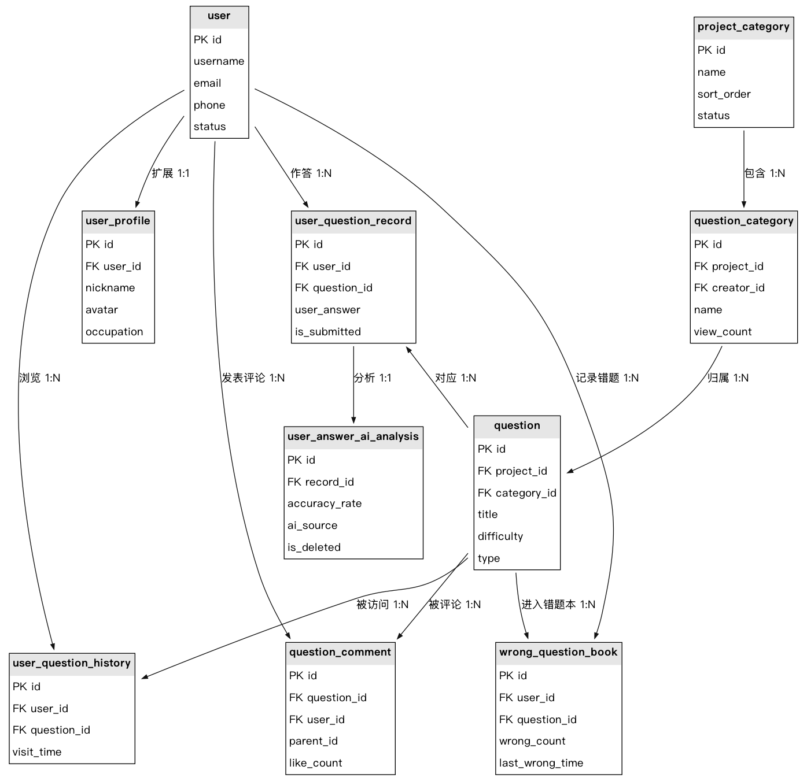{ width=92% }

图3-5 数据库核心表ER图

### 3.5.2 数据库逻辑结构设计

#### 3.5.2.1 用户信息表设计

用户信息表是平台识别学习主体的基础数据表，主要用于保存登录认证所需的用户名、密码以及邮箱、手机号等唯一身份信息。系统中的用户资料、答题记录、题目评论、错题本和浏览历史等业务数据均通过该表主键进行关联，因此该表是整个数据库设计中的枢纽实体。字段 `status` 用于标记账号是否处于有效状态，便于管理员执行启停管理；`create_time` 和 `update_time` 则用于记录账号生命周期变化，为后台审计、异常追踪和用户行为归属提供基础依据。

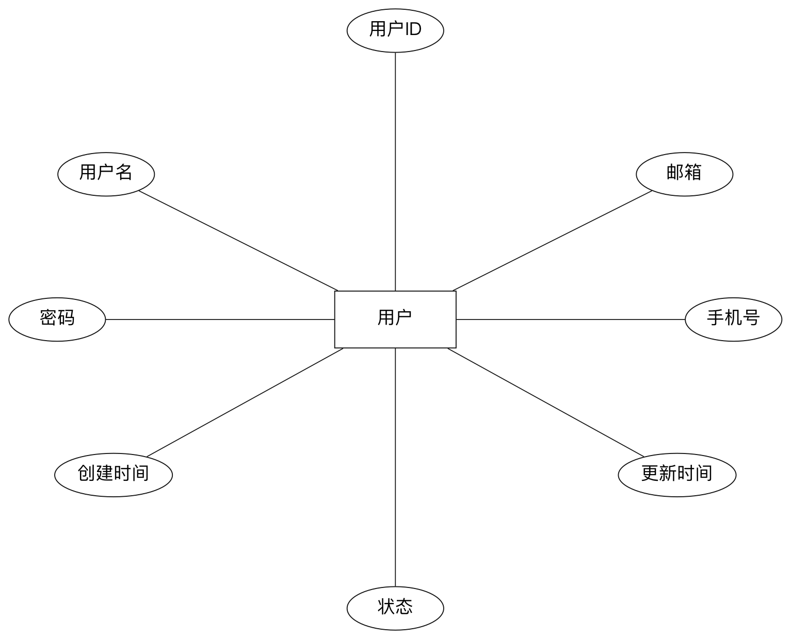{ width=92% }

图3-6 用户信息实体分析结构图

表3-1 user表设计

| 字段名 | 类型 | 约束 | 可空 | 含义 |
| --- | --- | --- | --- | --- |
| id | bigint | PK | 否 | 用户唯一标识 |
| username | varchar(32) | UNIQUE | 否 | 用户登录名 |
| password | varchar(128) | - | 否 | 加密后的登录密码 |
| email | varchar(64) | UNIQUE | 是 | 用户邮箱 |
| phone | varchar(20) | UNIQUE | 是 | 用户手机号 |
| status | tinyint | - | 否 | 账号状态，1 表示正常，0 表示禁用 |
| create_time | datetime | - | 否 | 记录创建时间 |
| update_time | datetime | - | 否 | 记录最后更新时间 |

#### 3.5.2.2 用户资料表设计

用户资料表用于保存用户在完成注册之后的扩展信息，是用户信息表的补充实体。该表重点记录昵称、头像、性别、年龄、地区、个人简介和职业等展示性资料，使平台能够在评论互动、个人主页和成就展示场景中向前端输出更完整的用户形象数据。该表通过 `user_id` 与用户信息表形成一对一关联，并通过 `display_achievement_id` 关联展示成就，用于支持个性化展示和成长激励等功能，因此在用户体验层面具有重要作用。

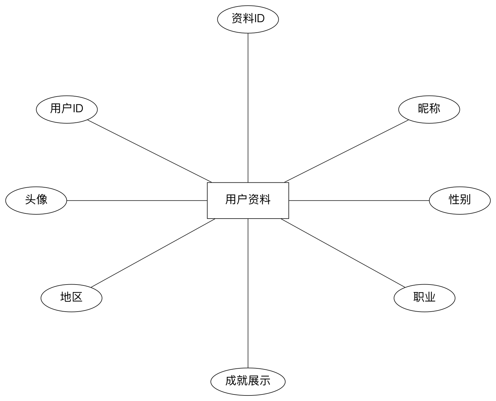{ width=92% }

图3-7 用户资料实体分析结构图

表3-2 user_profile表设计

| 字段名 | 类型 | 约束 | 可空 | 含义 |
| --- | --- | --- | --- | --- |
| id | bigint | PK | 否 | 用户资料记录编号 |
| user_id | bigint | FK -> user.id，UNIQUE | 否 | 对应的用户编号 |
| nickname | varchar(32) | - | 是 | 用户昵称 |
| avatar | varchar(255) | - | 是 | 用户头像地址 |
| gender | tinyint | - | 是 | 性别，0 表示未知，1 表示男，2 表示女 |
| age | int | - | 是 | 年龄 |
| birthday | date | - | 是 | 生日 |
| location | varchar(100) | - | 是 | 所在地区 |
| bio | varchar(500) | - | 是 | 个人简介 |
| display_achievement_id | bigint | FK -> achievement.id | 是 | 当前展示成就编号 |
| create_time | datetime | - | 否 | 资料创建时间 |
| update_time | datetime | - | 否 | 资料更新时间 |
| occupation | int | - | 是 | 职业枚举值 |

#### 3.5.2.3 项目分类表设计

项目分类表用于在更高层次上组织平台中的题库资源，是题库分类和题目数据的上级容器。例如，Java 面试题、软考题库或其他专题项目都可以作为独立项目分类存在。通过该表，系统能够在首页、导航栏和学习页中以项目维度组织不同知识域的学习资源，并为后续分类筛选、项目偏好选择和项目级统计提供统一入口。`sort_order` 字段用于控制前端展示顺序，`status` 字段则用于决定该项目分类是否对外可见。

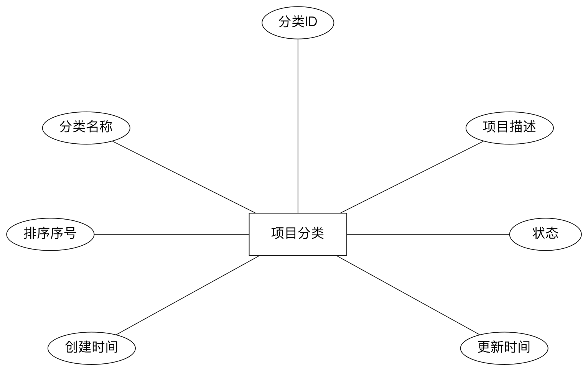{ width=92% }

图3-8 项目分类实体分析结构图

表3-3 project_category表设计

| 字段名 | 类型 | 约束 | 可空 | 含义 |
| --- | --- | --- | --- | --- |
| id | bigint | PK | 否 | 项目分类唯一标识 |
| name | varchar(50) | - | 否 | 项目分类名称 |
| description | varchar(200) | - | 是 | 项目分类说明 |
| sort_order | int | - | 否 | 展示排序值 |
| status | tinyint | - | 否 | 分类状态，1 表示正常，0 表示禁用 |
| create_time | datetime | - | 否 | 创建时间 |
| update_time | datetime | - | 否 | 更新时间 |

#### 3.5.2.4 题库分类表设计

题库分类表用于在项目分类之下进一步细化题库内容，是题库资源的直接组织单元。系统中的题目列表、推荐分类、分类详情和访问量统计等功能，均依赖该表维护分类名称、描述、头像和排序等基础信息。该表通过 `project_id` 关联项目分类，通过 `creator_id` 关联创建用户，因此既体现了题库所属关系，也保留了题库创建来源。`view_count` 字段可用于热门分类统计与推荐逻辑，是连接静态分类数据与动态访问数据的重要桥梁。

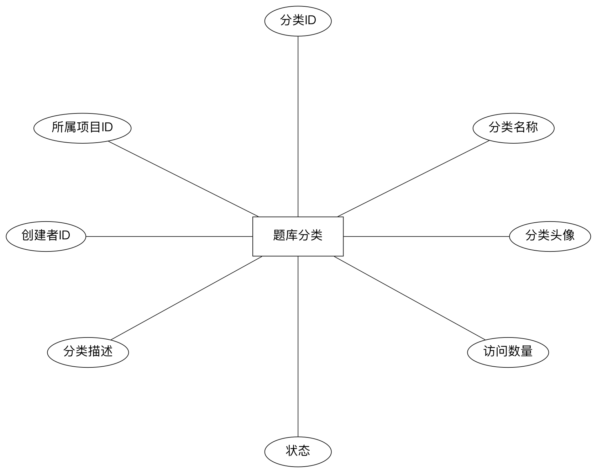{ width=92% }

图3-9 题库分类实体分析结构图

表3-4 question_category表设计

| 字段名 | 类型 | 约束 | 可空 | 含义 |
| --- | --- | --- | --- | --- |
| id | bigint | PK | 否 | 题库分类编号 |
| project_id | bigint | FK -> project_category.id | 否 | 所属项目分类编号 |
| name | varchar(50) | - | 否 | 题库分类名称 |
| description | varchar(200) | - | 是 | 题库分类描述 |
| creator_id | bigint | FK -> user.id | 否 | 分类创建者编号 |
| avatar_url | varchar(255) | - | 是 | 分类头像地址 |
| sort_order | int | - | 是 | 分类排序值 |
| view_count | bigint | - | 否 | 分类访问次数 |
| status | tinyint | - | 否 | 分类状态标记 |
| create_time | datetime | - | 否 | 创建时间 |
| update_time | datetime | - | 否 | 更新时间 |

#### 3.5.2.5 题目内容表设计

题目内容表是整个平台最核心的业务表之一，直接用于保存题目标题、题干、标准答案、难度级别、题目类型以及标签信息等关键内容。题库浏览、题目详情、答题提交、AI 解析和向量检索等核心业务均以该表为基础，因此该表既是知识内容存储中心，也是学习行为触发中心。表中 `project_id` 和 `category_id` 保证题目具备明确的层级归属，`difficulty` 和 `type` 字段则为前端筛选、学习规划和统计分析提供关键维度，`view_count` 字段可用于计算热门题目。

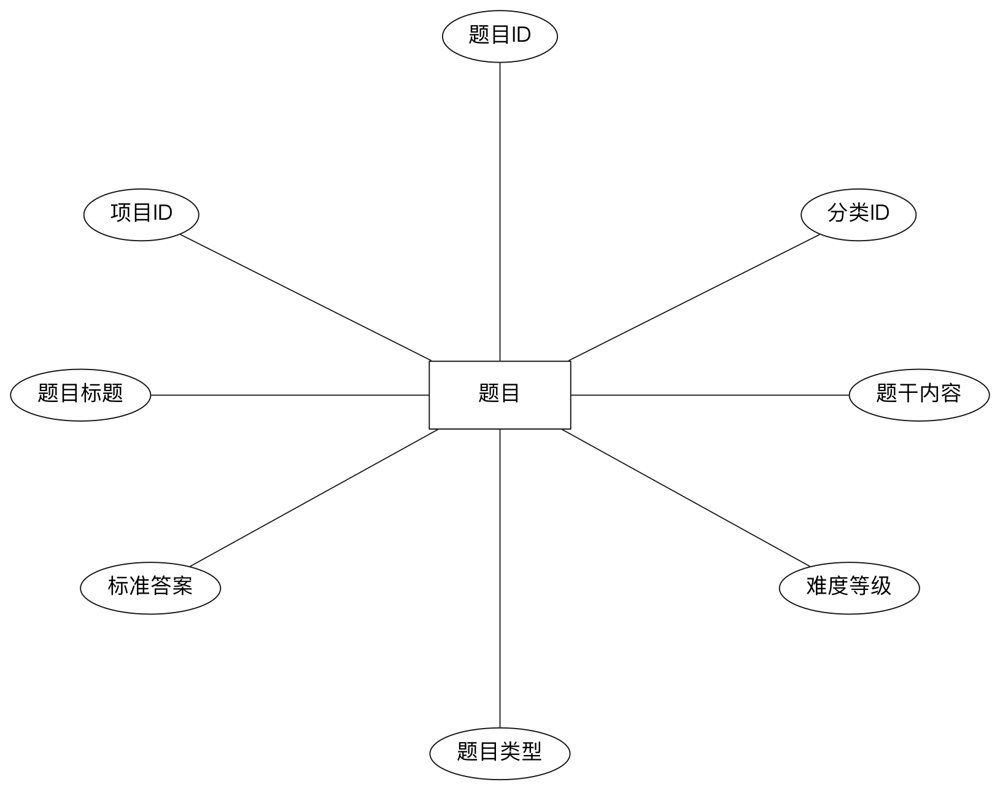{ width=92% }

图3-10 题目内容实体分析结构图

表3-5 question表设计

| 字段名 | 类型 | 约束 | 可空 | 含义 |
| --- | --- | --- | --- | --- |
| id | bigint | PK | 否 | 题目唯一标识 |
| project_id | bigint | FK -> project_category.id | 否 | 所属项目分类编号 |
| category_id | bigint | FK -> question_category.id | 否 | 所属题库分类编号 |
| title | varchar(500) | - | 否 | 题目标题 |
| content | text | - | 否 | 题目正文内容 |
| answer | text | - | 否 | 标准答案内容 |
| difficulty | tinyint | - | 否 | 题目难度等级 |
| type | tinyint | - | 否 | 题目类型 |
| tag_category_ids | json | - | 否 | 标签分类编号集合 |
| status | tinyint | - | 否 | 题目状态标记 |
| view_count | bigint | - | 否 | 题目浏览次数 |
| create_time | datetime | - | 否 | 创建时间 |
| update_time | datetime | - | 否 | 更新时间 |

#### 3.5.2.6 用户答题记录表设计

用户答题记录表用于保存用户与题目之间的作答关系，是学习过程数据中最关键的行为表。每当用户在题目详情页输入答案、保存草稿或提交作答时，系统都会以该表记录用户答案文本及提交状态。该表通过 `user_id` 和 `question_id` 将用户与具体题目连接起来，既是 AI 分析的直接输入来源，也是后续错题统计、学习轨迹分析和答题历史查询的重要基础。`is_submitted` 字段可以区分草稿状态与正式提交状态，从而支持反复练习和重新作答场景。

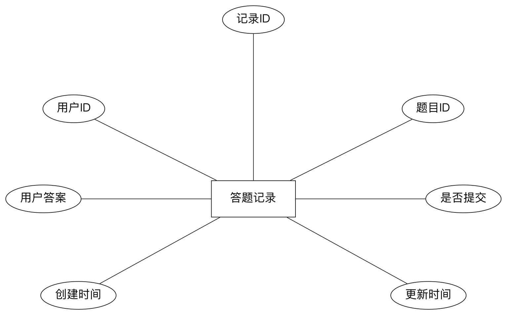{ width=92% }

图3-11 用户答题记录实体分析结构图

表3-6 user_question_record表设计

| 字段名 | 类型 | 约束 | 可空 | 含义 |
| --- | --- | --- | --- | --- |
| id | bigint | PK | 否 | 答题记录编号 |
| user_id | bigint | FK -> user.id | 否 | 作答用户编号 |
| question_id | bigint | FK -> question.id | 否 | 被作答题目编号 |
| user_answer | text | - | 否 | 用户答案内容 |
| is_submitted | tinyint | - | 否 | 是否已提交，1 表示已提交，0 表示未提交 |
| create_time | datetime | - | 否 | 记录创建时间 |
| update_time | datetime | - | 否 | 记录更新时间 |

#### 3.5.2.7 用户答案AI分析表设计

用户答案 AI 分析表用于保存大模型对用户作答结果的智能评估信息，是平台实现智能反馈闭环的重要结果表。当用户提交答案并触发 AI 解析后，系统会将准确率、文字解析内容以及模型来源等信息写入该表，并通过 `record_id` 与答题记录形成一对一对应关系。该表一方面为用户提供可读性较强的学习反馈，另一方面也便于平台后续统计不同题目、不同用户或不同模型的解析效果，具备较强的扩展价值。

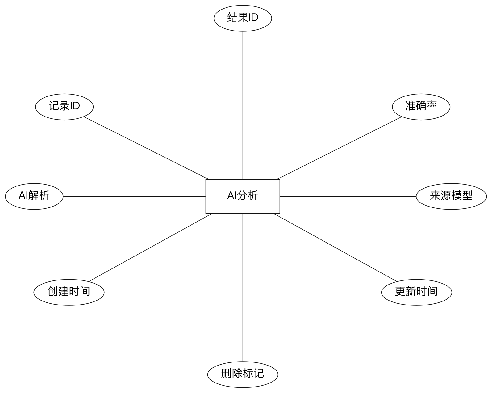{ width=92% }

图3-12 用户答案AI分析实体分析结构图

表3-7 user_answer_ai_analysis表设计

| 字段名 | 类型 | 约束 | 可空 | 含义 |
| --- | --- | --- | --- | --- |
| id | bigint | PK | 否 | AI 分析结果编号 |
| record_id | bigint | FK -> user_question_record.id | 否 | 对应答题记录编号 |
| accuracy_rate | tinyint UNSIGNED | - | 否 | AI 判定准确率 |
| ai_explanation | text | - | 否 | AI 生成的文字解析内容 |
| ai_source | varchar(100) | - | 否 | AI 模型来源标识 |
| is_deleted | tinyint(1) | - | 否 | 逻辑删除标记 |
| create_time | datetime | - | 否 | 创建时间 |
| update_time | datetime | - | 否 | 更新时间 |

#### 3.5.2.8 题目评论表设计

题目评论表主要用于承载题目详情页中的交流互动数据，支持用户围绕题目内容、答案理解和解析过程进行讨论。该表同时关联题目和用户，因此能够准确描述“哪位用户在什么题目下发表了什么评论”。`parent_id` 字段用于构建回复链路，从而支持多层级评论树结构；`like_count` 字段则用于保存评论热度，为前端排序和高质量评论展示提供支持。评论功能的引入使平台从单纯的练习系统扩展为具备社交讨论属性的学习社区。

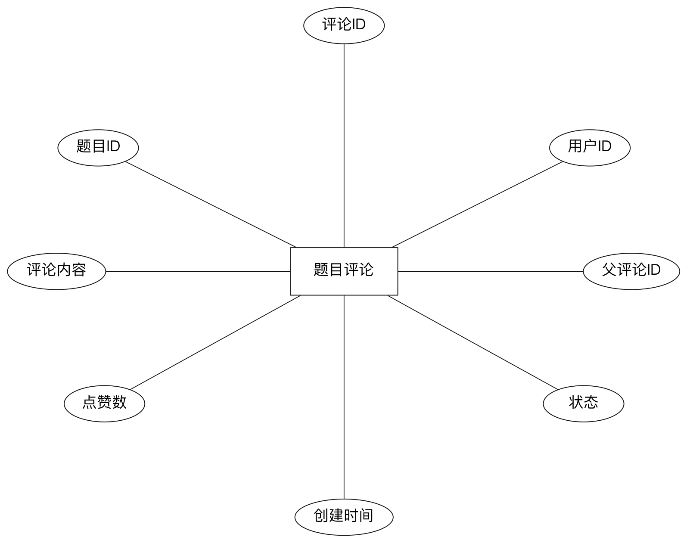{ width=92% }

图3-13 题目评论实体分析结构图

表3-8 question_comment表设计

| 字段名 | 类型 | 约束 | 可空 | 含义 |
| --- | --- | --- | --- | --- |
| id | bigint | PK | 否 | 评论唯一标识 |
| question_id | bigint | FK -> question.id | 否 | 所属题目编号 |
| user_id | bigint | FK -> user.id | 否 | 评论用户编号 |
| content | text | - | 否 | 评论正文内容 |
| parent_id | bigint | FK -> question_comment.id | 是 | 父评论编号，用于回复 |
| like_count | int | - | 是 | 点赞数量 |
| status | tinyint | - | 否 | 评论状态标记 |
| create_time | datetime | - | 否 | 评论创建时间 |
| update_time | datetime | - | 否 | 评论更新时间 |

#### 3.5.2.9 错题本表设计

错题本表用于记录用户在答题过程中出现错误的题目及其错误情况，是平台支持复盘学习和针对性巩固的重要数据结构。该表通过 `user_id` 和 `question_id` 形成联合唯一约束，保证同一用户对同一题目只保留一条错题主记录，并通过 `wrong_count`、`last_wrong_time` 和 `last_wrong_answer` 等字段持续追踪错误次数、最近错误时间与错误内容。结合备注字段，用户还可以对易错原因进行自定义记录，从而增强系统在个性化学习与错题回顾场景中的实用性。

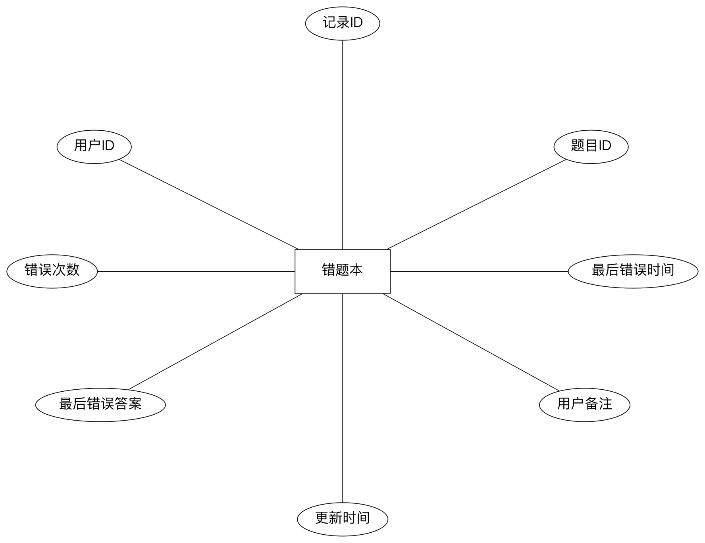{ width=92% }

图3-14 错题本实体分析结构图

表3-9 wrong_question_book表设计

| 字段名 | 类型 | 约束 | 可空 | 含义 |
| --- | --- | --- | --- | --- |
| id | bigint | PK | 否 | 错题记录编号 |
| user_id | bigint | FK -> user.id，联合唯一 | 否 | 用户编号 |
| question_id | bigint | FK -> question.id，联合唯一 | 否 | 题目编号 |
| wrong_count | int | - | 否 | 累计错误次数 |
| last_wrong_time | datetime | - | 否 | 最近一次答错时间 |
| last_wrong_answer | text | - | 否 | 最近一次错误答案 |
| remark | varchar(500) | - | 是 | 用户备注信息 |
| create_time | datetime | - | 否 | 创建时间 |
| update_time | datetime | - | 否 | 更新时间 |

#### 3.5.2.10 用户浏览历史表设计

用户浏览历史表用于记录用户访问题目详情页的过程数据，是学习轨迹分析、最近浏览记录和学习连续性判断的重要依据。虽然该表字段数量相对较少，但其业务价值较高，因为平台可以据此统计用户近期关注过的题目、恢复最近学习位置，并为推荐逻辑提供行为证据。该表通过 `user_id` 和 `question_id` 建立用户与题目之间的访问关系，`visit_time` 字段则完整保留了用户的访问时间信息，为时间序列分析和热度计算提供原始数据来源。

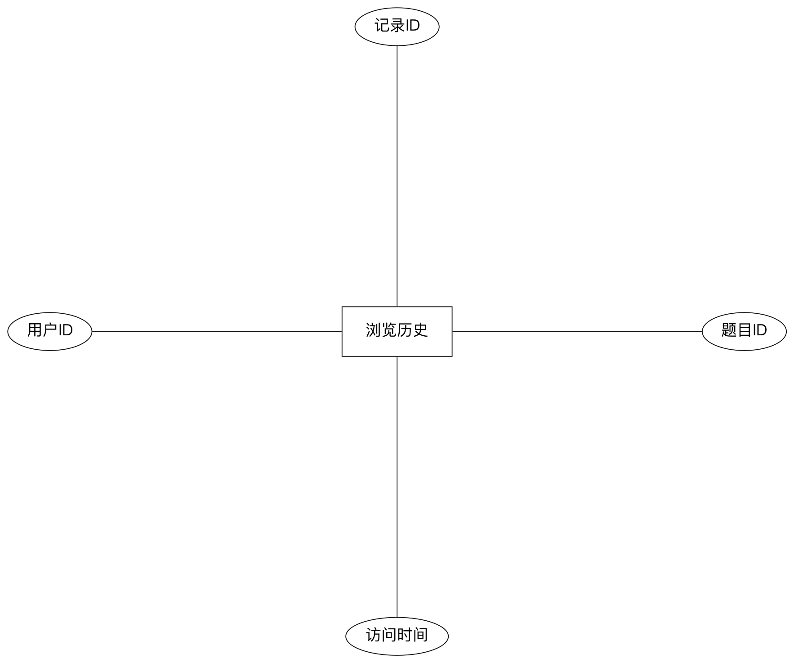{ width=92% }

图3-15 用户浏览历史实体分析结构图

表3-10 user_question_history表设计

| 字段名 | 类型 | 约束 | 可空 | 含义 |
| --- | --- | --- | --- | --- |
| id | bigint | PK | 否 | 浏览记录编号 |
| user_id | bigint | FK -> user.id | 否 | 浏览用户编号 |
| question_id | bigint | FK -> question.id | 否 | 被浏览题目编号 |
| visit_time | datetime | - | 否 | 题目访问时间 |

综上所述，以上 10 张表从基础主体、题库资源、学习行为和反馈结果四个层面构成了系统数据库的主要骨架。通过项目分类、题库分类和题目之间的层次组织关系，系统能够完成知识资源管理；通过答题记录、AI 分析、评论、错题本和浏览历史等过程表，系统能够持续沉淀用户学习行为数据，并为后续的学习统计、智能反馈和个性化服务提供数据基础。
